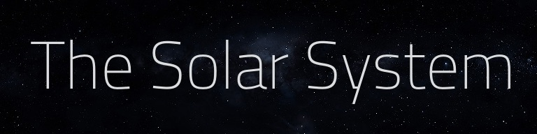

The Solar System app shows an interactive 3d representation of the solar system. [See the simulation here](https://mdorr.github.io/solar-system/).

## Usage

Click and drag the mouse to rotate. Use the Mouse Wheel to zoom. Use the navigation link or click any label to zoom in on a Planet. To read more details about a planet, click the Details button.

## Requirements

The simulation needs a WebGL-capable browser such as Chrome or Safari.

## Used resources

The app uses [three.js](https://threejs.org/) as a WebGL wrapper. Additional functionality is provided by [jQuery](http://jquery.com/).

## About the accuracy of the simulator

The relative sizes of the Planets and the orbits are accurate. However, not all orbital movements and parameters are represented. Only the general orbital parameters such as Aphelion, Perihelion, and the inclination are considered.

The Planet show the correct axial tilt, and the relative orbital velocities are simulated. However, the relative planet rotation is not simulated.

The gravitational influence of the planets on the Sun is not simulated. In the simulation, the Sun has a static position.

## Acknowledgements
Some of the graphics used are kindly provided by:

* [Solar System Scope](http://www.solarsystemscope.com/textures/) by INOVE
* [Planet Pixel Emporium](http://planetpixelemporium.com/planets.html) by James Hastings-Trew

Planet descriptions and astronomical data from [Wikipedia](https://en.wikipedia.org), the free encyclopedia.

This project uses the [Titillium](http://www.campivisivi.net/titillium/) font.

## About the Author

My name is Maurice Spiewack, and I am a Software Engineer. When growing up, I wanted to become an astronaut like so many other boys; while I did not do that, I always was, and am, fascinated by the stars.

You can find my other work on my [portfolio site](http://www.spiewack.com), or right here on [GitHub](https://www.github.com/mdorr).
